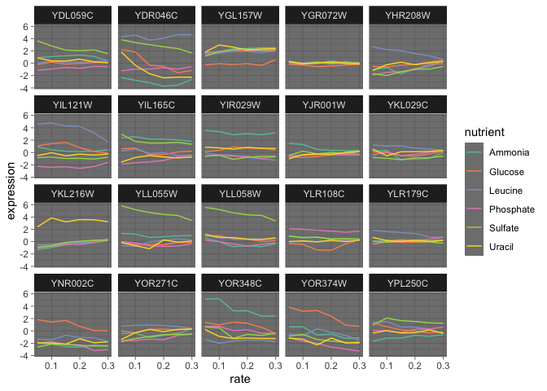

Can gene expression predict limiting nutrients in a random forest model?
================
Neil Saunders
2019-06-26 21:09:02

# Introduction

Can we use random forest to predict which of 6 nutrients is limiting the
growth of yeast, based on gene expression?

Inspired by a now-deleted question on Stack Overflow \[r\].

# Dataset

We obtain a tidy version of the
[Brauer 2008](https://www.ncbi.nlm.nih.gov/pmc/articles/PMC2174172/)
dataset in CSV format from [this
page](https://4va.github.io/biodatasci/r-dataviz-homework.html).

``` r
brauer2007_tidy <- read_csv("https://4va.github.io/biodatasci/data/brauer2007_tidy.csv")
```

The dataset contains 198430 rows. It can be thought of as 36 separate
experiments: yeast are grown at 6 different growth rates, with 6
nutrients where one is supplied at limiting levels. Gene expression is
measured in each case - the number of genes varies slightly but is
around 5 500.

# Random forest model

We specify a classification model where the categorical outcome variable
is the nutrient, and the predictors are gene expression values and rate.
Rate is assumed not to be important in this model.

We used `set.seed` here for reproducibility, but it would not normally
be used for random forest.

``` r
set.seed(1001)

brauer2007_tidy_rf1 <- brauer2007_tidy %>% 
  mutate(systematic_name = gsub("-", "minus", systematic_name), 
         nutrient = factor(nutrient)) %>% 
  select(systematic_name, nutrient, rate, expression) %>% 
  spread(systematic_name, expression, fill = 0) %>% 
  randomForest(nutrient ~ ., data = ., localImp = TRUE, importance = TRUE)
```

# Top 20 variables by importance

We plot the expression of the top 20 most important variables (genes) by
rate and nutrient.

`important_variables` is a function from the `randomForestExplainer`
package.

``` r
brauer2007_tidy %>% 
  filter(systematic_name %in% important_variables(brauer2007_tidy_rf1, k = 20)) %>% 
  ggplot(aes(rate, expression)) + 
  geom_line(aes(color = nutrient)) + 
  facet_wrap(~systematic_name, ncol = 5) + 
  scale_color_brewer(palette = "Set2")
```

<!-- -->

# Research into a selection of the top 20 genes

We select for each of the 6 nutrients, one gene from the top 20 with a
distinctive expression pattern when that nutrient is limited.

Then we search the web using the term “gene name + nutrient” to see if
there are any known associations, using resources such as the
[Saccharomyces Genome Database](https://www.yeastgenome.org/).

We can say that the expression pattern under nutrient limitation “makes
sense” for 5 of the genes, given what is known about their function. The
exception is YLR108C, which is moderately up-regulated under phosphate
limitation.

| systematic\_name |                       bp                        | nutrient  |                                                    search\_results                                                    |
| :--------------: | :---------------------------------------------: | :-------: | :-------------------------------------------------------------------------------------------------------------------: |
|     YHR208W      | branched chain family amino acid biosynthesis\* |  leucine  |                    [Pathways - leucine biosynthesis](https://www.yeastgenome.org/locus/S000001251)                    |
|     YKL216W      |     ‘de novo’ pyrimidine base biosynthesis      |  uracil   |                  [URA1 - null mutant requires uracil](https://www.yeastgenome.org/locus/S000001699)                   |
|     YLL055W      |           biological process unknown            |  sulfate  | [Cysteine transporter; null mutant absent utilization of sulfur source](https://www.yeastgenome.org/locus/S000003978) |
|     YLR108C      |           biological process unknown            | phosphate |                                                                                                                       |
|     YOR348C      |              proline catabolism\*               |  ammonia  |          [Proline permease; repressed in ammonia-grown cells](https://www.yeastgenome.org/locus/S000005875)           |
|     YOR374W      |               ethanol metabolism                |  glucose  |        [Aldehyde dehydrogenase; expression is glucose-repressed](https://www.yeastgenome.org/locus/S000005901)        |

# Summary

Random forest would be far from my first method of choice for this
problem. It would be more usual to determine first which genes were
differentially-expressed, then go back and examine the nutrient
limitation data. However, random forest does seem to have identified
genes that are differentially expressed under nutrient limitation, and
which have known biological functions consistent with their expression
in the Brauer data.
