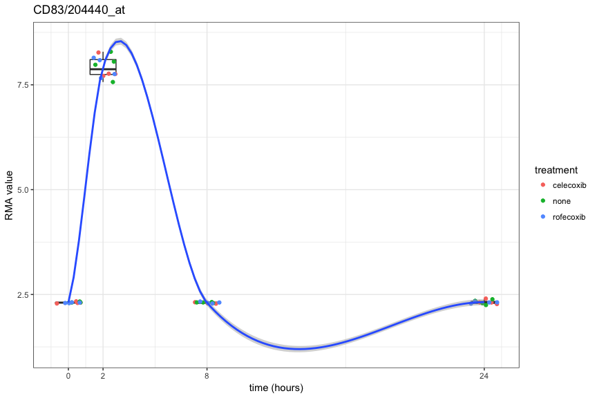
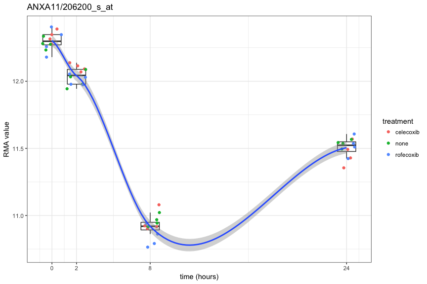
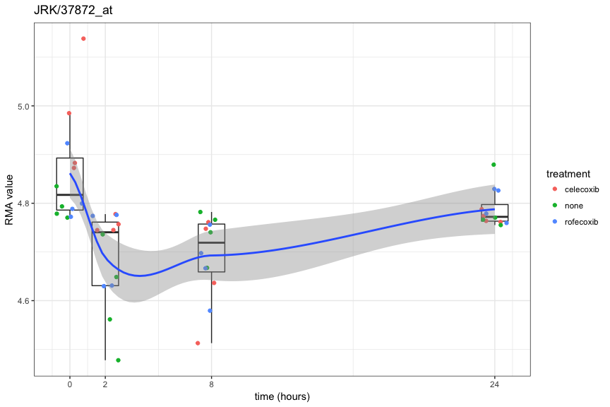
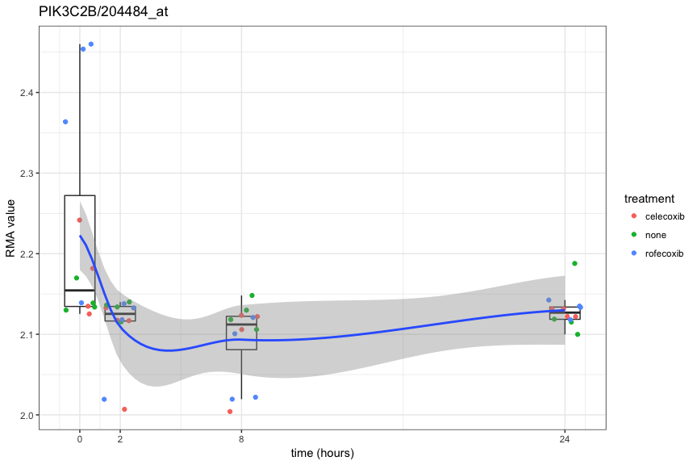

Analysis of gene expression timecourse data using maSigPro
================
Neil Saunders
2018-04-03 21:50:36

-   [Introduction](#introduction)
-   [Retrieving data using GEOquery](#retrieving-data-using-geoquery)
    -   [Expression data](#expression-data)
    -   [Phenotypic data](#phenotypic-data)
-   [Creating a design matrix](#creating-a-design-matrix)
-   [Fitting the regression model](#fitting-the-regression-model)
    -   [From regression model to significant genes](#from-regression-model-to-significant-genes)
    -   [Matching probesets to genes using biomaRt](#matching-probesets-to-genes-using-biomart)
-   [Plotting timecourses for genes of interest](#plotting-timecourses-for-genes-of-interest)
    -   [Control samples](#control-samples)
    -   [Treated samples](#treated-samples)
-   [Summary](#summary)

Introduction
============

This tutorial looks at how to use the Bioconductor package [maSigPro](http://www.bioconductor.org/packages/release/bioc/html/maSigPro.html) to analyse the expression of genes over time.

Retrieving data using GEOquery
==============================

First, we search the [NCBI GEO database](http://www.ncbi.nlm.nih.gov/geo) for suitable public datasets. The experimental design criteria that we would like to satisfy are:

-   several timepoints
-   several samples per timepoint
-   clarity in how expression data were obtained (normalisation, log2 values)
-   of some biological interest (easy to link to other data sources)

Datasets that satisfy these criteria are not easy to discover. Eventually we settled on the study titled [Celecoxib, rofecoxib treated human smooth muscle cells microarray timecourse (GSE59671)](http://www.ncbi.nlm.nih.gov/geo/query/acc.cgi?acc=GSE59671). In this study cells were pre-treated with one of two drugs then exposed to a protein, interleukin 1-beta, involved in inflammatory responses. Four biological replicates for each drug treatment and untreated controls were analysed at 0, 2, 8 and 24 hours post-IL1b exposure, generating 4 x 3 x 4 = 48 samples. A further 4 control samples were collected at "-2 hours", i.e. prior to IL1b-exposure.

Expression data
---------------

First we fetch the GEO series dataset using GEOquery. Getting the expression values is easy using *exprs()*. A quick check to see that they "look like" normalised log2 values (it's stated that they are at the GEO website).

<table style="width:72%;">
<colgroup>
<col width="18%" />
<col width="18%" />
<col width="18%" />
<col width="18%" />
</colgroup>
<thead>
<tr class="header">
<th align="right">GSM1442176</th>
<th align="right">GSM1442177</th>
<th align="right">GSM1442178</th>
<th align="right">GSM1442179</th>
</tr>
</thead>
<tbody>
<tr class="odd">
<td align="right">9.229</td>
<td align="right">9.371</td>
<td align="right">9.369</td>
<td align="right">9.458</td>
</tr>
<tr class="even">
<td align="right">7.297</td>
<td align="right">7.113</td>
<td align="right">7.315</td>
<td align="right">7.265</td>
</tr>
<tr class="odd">
<td align="right">2.37</td>
<td align="right">2.412</td>
<td align="right">2.405</td>
<td align="right">2.424</td>
</tr>
<tr class="even">
<td align="right">5.686</td>
<td align="right">5.719</td>
<td align="right">5.941</td>
<td align="right">5.725</td>
</tr>
</tbody>
</table>

Phenotypic data
---------------

"Phenotypic" data, the details of the experimental design, can be accessed using *pData()*.

    ##  [1] "title"                    "geo_accession"           
    ##  [3] "status"                   "submission_date"         
    ##  [5] "last_update_date"         "type"                    
    ##  [7] "channel_count"            "source_name_ch1"         
    ##  [9] "organism_ch1"             "characteristics_ch1"     
    ## [11] "characteristics_ch1.1"    "characteristics_ch1.2"   
    ## [13] "characteristics_ch1.3"    "characteristics_ch1.4"   
    ## [15] "characteristics_ch1.5"    "biomaterial_provider_ch1"
    ## [17] "treatment_protocol_ch1"   "growth_protocol_ch1"     
    ## [19] "molecule_ch1"             "extract_protocol_ch1"    
    ## [21] "label_ch1"                "label_protocol_ch1"      
    ## [23] "taxid_ch1"                "hyb_protocol"            
    ## [25] "scan_protocol"            "description"             
    ## [27] "data_processing"          "platform_id"             
    ## [29] "contact_name"             "contact_email"           
    ## [31] "contact_laboratory"       "contact_department"      
    ## [33] "contact_institute"        "contact_address"         
    ## [35] "contact_city"             "contact_state"           
    ## [37] "contact_zip/postal_code"  "contact_country"         
    ## [39] "supplementary_file"       "data_row_count"          
    ## [41] "relation"                 "cell type:ch1"           
    ## [43] "gender:ch1"               "material type:ch1"       
    ## [45] "nsaid treatment:ch1"      "race:ch1"                
    ## [47] "time point:ch1"

We can see that times and treatments are captured in the title attribute.

    ## [1] "hasmc_celecoxib_tp0hr_biological rep1"

Creating a design matrix
========================

We can parse the sample titles using *str\_match* from the *stringr* package, then do some data cleaning to create the data frame used for the design matrix.

<table style="width:100%;">
<colgroup>
<col width="9%" />
<col width="14%" />
<col width="8%" />
<col width="14%" />
<col width="9%" />
<col width="12%" />
<col width="14%" />
<col width="14%" />
</colgroup>
<thead>
<tr class="header">
<th align="right">cell</th>
<th align="right">agent</th>
<th align="right">Time</th>
<th align="right">Replicate</th>
<th align="right">hasmc</th>
<th align="right">Control</th>
<th align="right">celecoxib</th>
<th align="right">rofecoxib</th>
</tr>
</thead>
<tbody>
<tr class="odd">
<td align="right">hasmc</td>
<td align="right">celecoxib</td>
<td align="right">0</td>
<td align="right">rep1</td>
<td align="right">1</td>
<td align="right">0</td>
<td align="right">1</td>
<td align="right">0</td>
</tr>
<tr class="even">
<td align="right">hasmc</td>
<td align="right">celecoxib</td>
<td align="right">0</td>
<td align="right">rep2</td>
<td align="right">1</td>
<td align="right">0</td>
<td align="right">1</td>
<td align="right">0</td>
</tr>
<tr class="odd">
<td align="right">hasmc</td>
<td align="right">celecoxib</td>
<td align="right">0</td>
<td align="right">rep3</td>
<td align="right">1</td>
<td align="right">0</td>
<td align="right">1</td>
<td align="right">0</td>
</tr>
<tr class="even">
<td align="right">hasmc</td>
<td align="right">celecoxib</td>
<td align="right">0</td>
<td align="right">rep4</td>
<td align="right">1</td>
<td align="right">0</td>
<td align="right">1</td>
<td align="right">0</td>
</tr>
<tr class="odd">
<td align="right">hasmc</td>
<td align="right">celecoxib</td>
<td align="right">2</td>
<td align="right">rep1</td>
<td align="right">1</td>
<td align="right">0</td>
<td align="right">1</td>
<td align="right">0</td>
</tr>
</tbody>
</table>

The last steps are to drop the -2 hour samples (to simplify things), number the replicates correctly and importantly, add the GEO sample names as row names in the data frame <code>pd.res</code>, so as the expression data matches the phenotypic data.

Now we can make the design matrix from the data frame with degree = 3 (4 timepoints - 1). Note that times and replicates are given their numeric values; conditions (cell type, control or treated) are signified by values of 0 or 1.

<table style="width:74%;">
<colgroup>
<col width="9%" />
<col width="16%" />
<col width="13%" />
<col width="16%" />
<col width="16%" />
</colgroup>
<thead>
<tr class="header">
<th align="right">Time</th>
<th align="right">Replicate</th>
<th align="right">Control</th>
<th align="right">celecoxib</th>
<th align="right">rofecoxib</th>
</tr>
</thead>
<tbody>
<tr class="odd">
<td align="right">0</td>
<td align="right">1</td>
<td align="right">0</td>
<td align="right">1</td>
<td align="right">0</td>
</tr>
<tr class="even">
<td align="right">0</td>
<td align="right">1</td>
<td align="right">0</td>
<td align="right">1</td>
<td align="right">0</td>
</tr>
<tr class="odd">
<td align="right">0</td>
<td align="right">1</td>
<td align="right">0</td>
<td align="right">1</td>
<td align="right">0</td>
</tr>
<tr class="even">
<td align="right">0</td>
<td align="right">1</td>
<td align="right">0</td>
<td align="right">1</td>
<td align="right">0</td>
</tr>
<tr class="odd">
<td align="right">2</td>
<td align="right">2</td>
<td align="right">0</td>
<td align="right">1</td>
<td align="right">0</td>
</tr>
</tbody>
</table>

Fitting the regression model
============================

From regression model to significant genes
------------------------------------------

Now we proceed exactly as described in the maSigPro users guide, fitting a regression model to discover probesets with significant differential expression over time. The functions *p.vector()* and *T.fit()* use *print()* to report progress, so we're hiding that output here using *capture.output()*.

The list *sigs* is a surprisingly complex object.

    ## List of 2
    ##  $ sig.genes:List of 3
    ##   ..$ Control           :List of 7
    ##   .. ..$ sig.profiles :'data.frame': 4757 obs. of  48 variables:
    ##   .. ..$ coefficients :'data.frame': 4757 obs. of  12 variables:
    ##   .. ..$ group.coeffs :'data.frame': 4757 obs. of  12 variables:
    ##   .. ..$ sig.pvalues  :'data.frame': 4757 obs. of  14 variables:
    ##   .. ..$ g            : int 4757
    ##   .. ..$ edesign      :'data.frame': 48 obs. of  5 variables:
    ##   .. ..$ groups.vector: chr [1:12] "Control" "celecoxibvsControl" "rofecoxibvsControl" "Control" ...
    ##   ..$ celecoxibvsControl:List of 7
    ##   .. ..$ sig.profiles :'data.frame': 769 obs. of  48 variables:
    ##   .. ..$ coefficients :'data.frame': 769 obs. of  12 variables:
    ##   .. ..$ group.coeffs :'data.frame': 769 obs. of  12 variables:
    ##   .. ..$ sig.pvalues  :'data.frame': 769 obs. of  14 variables:
    ##   .. ..$ g            : int 769
    ##   .. ..$ edesign      :'data.frame': 48 obs. of  5 variables:
    ##   .. ..$ groups.vector: chr [1:12] "Control" "celecoxibvsControl" "rofecoxibvsControl" "Control" ...
    ##   ..$ rofecoxibvsControl:List of 7
    ##   .. ..$ sig.profiles :'data.frame': 899 obs. of  48 variables:
    ##   .. ..$ coefficients :'data.frame': 899 obs. of  12 variables:
    ##   .. ..$ group.coeffs :'data.frame': 899 obs. of  12 variables:
    ##   .. ..$ sig.pvalues  :'data.frame': 899 obs. of  14 variables:
    ##   .. ..$ g            : int 899
    ##   .. ..$ edesign      :'data.frame': 48 obs. of  5 variables:
    ##   .. ..$ groups.vector: chr [1:12] "Control" "celecoxibvsControl" "rofecoxibvsControl" "Control" ...
    ##  $ summary  :'data.frame':   4757 obs. of  3 variables:
    ##   ..$ Control           : Factor w/ 4757 levels "1053_at","1294_at",..: 1 2 3 4 5 6 7 8 9 10 ...
    ##   ..$ celecoxibvsControl: Factor w/ 770 levels " ","1053_at",..: 2 3 4 5 6 7 8 9 10 11 ...
    ##   ..$ rofecoxibvsControl: Factor w/ 900 levels " ","1053_at",..: 2 3 4 5 6 7 8 9 10 11 ...

Detailed information about significant genes is stored in the list *sig.genes*. Since we specified <code>vars = "groups"</code>, times and treatments are returned together for each treatment. So for example, *sigs*s**i**g*.*g**e**n**e**s*Control* returns data for the Control (untreated) time points; *sigs*s**i**g*.*g**e**n**e**s*celecoxibvsControl* returns data for time points with the contrast celecoxib treatment versus Control.

We can get the data frames with p-values for control, celecoxib- and rofecoxib-treated cells.

Matching probesets to genes using biomaRt
-----------------------------------------

Next, we write a function that uses biomaRt to fetch HGNC gene symbols for the probesets.

Now we're ready to look at "interesting genes".

Plotting timecourses for genes of interest
==========================================

Control samples
---------------

Let's start with the control samples (no drug treatment), sorting on the p-value column. We then write a function that uses ggplot2 to plot the RMA expression values for the probeset corresponding to a given gene. We'll test it with the first probeset.

Expression of the gene CD83 rises dramatically in the first 2 hours after exposure to IL1b, then drops back to the base level by 8 hours. A quick Google search for the term "CD83 inflammation" indicates that the gene is involved with inflammatory responses.

Let's try another - say, number 6 in the list.

The ANXA11 gene is also involved with inflammation and shows the opposite behaviour to CD83; expression drops ~ 3-4 fold in the first 8 hours, then rises gradually from 8-24 hours.

Treated samples
---------------

Did the drug treatments make any difference to the IL1b response? Let's start with the best p-value for celecoxib versus Control.

There is some indication that expression of JRK post-IL1b exposure was lowered less between 0-2 hours in celecoxib-treated cells, but it's not incredibly convincing as the fold-change overall is quite low under all conditions. What about rofecoxib?

It appears that this p-value is driven by higher PIK3C2B expression in 3/4 rofecoxib-treated samples at t = 0. Perhaps the less-than-dramatic effects of drug treatment explain why this GEO series is not associated with a publication.

Summary
=======

-   maSigPro is a useful, effective package for analysis of timecourse microarray data
-   It combines well with ggplot2 to generate attractive and informative plots of gene expression over time
-   The example dataset GSE59671 reveals some interesting effects on the expression of inflammation-associated genes when cells are exposed to ILb1
